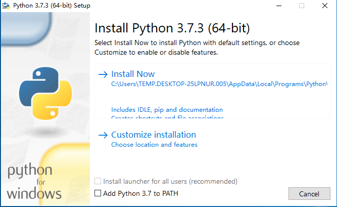
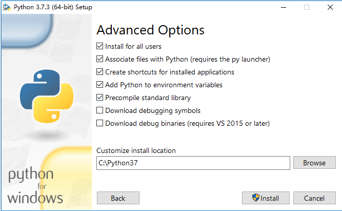
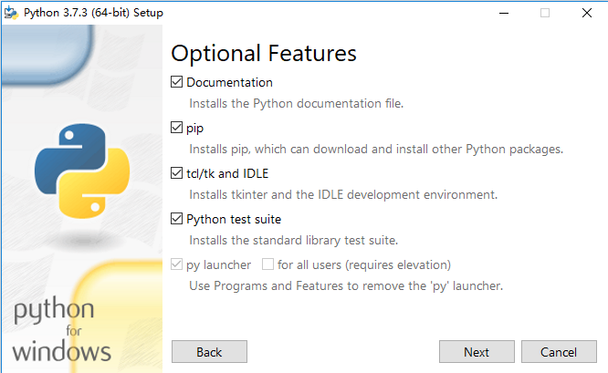
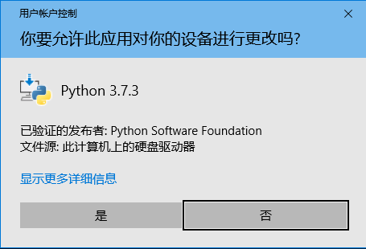
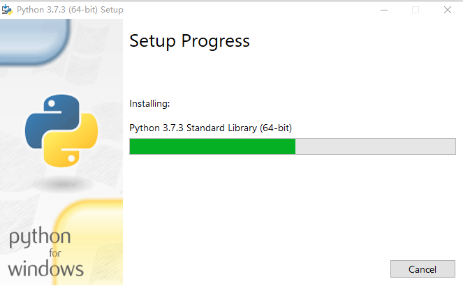
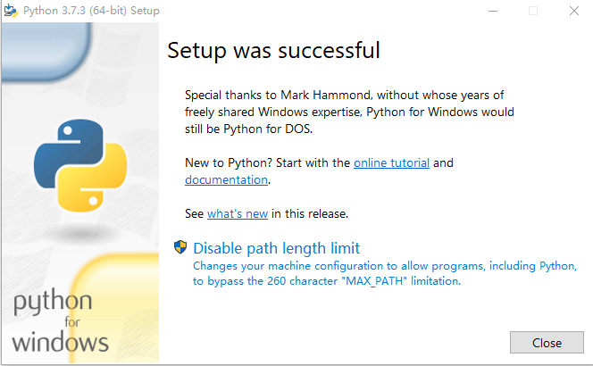

<!-- TOC -->

- [Install python for windows](#install-python-for-windows)
  - [Download Python](#download-python)
  - [Install Python](#install-python)
    - [Step 1](#step-1)
    - [Step 2](#step-2)
    - [Step 3](#step-3)
    - [Step 4](#step-4)
    - [Step 5](#step-5)
    - [Step 6](#step-6)
  - [Verify your python environment](#verify-your-python-environment)
- [Install Yan-ADK on windows](#install-yan-adk-on-windows)
  - [Creating virtual environments](#creating-virtual-environments)
  - [Activate virtual environments](#activate-virtual-environments)
  - [Install packages in virtual environments](#install-packages-in-virtual-environments)
- [Install packages to system envonments](#install-packages-to-system-envonments)

<!-- /TOC -->

# Install python for windows
## Download Python
Head on over to the [Python release](https://www.python.org/downloads/windows/). Choose 32 or 64 bit version based your environment.
## Install Python

### Step 1
Please execute the installation file. For example: python-3.7.3-amd64.exe


-- Please note, if you want execute python in 'cmd' mode, please choose "Add Python 3.7 to PATH". --

If you want to change the installation path, please click "Customize installation".

### Step 2
Here is an example.


### Step 3
Please choose the items your want. If you don't know what the difference between them, please install them all.


### Step 4
Please click "Yes" in this step, the installation application is trying to ask the privilege for python.


### Step 5
Please wait for a while.


### Step 6
This is the final step for installation.


## Verify your python environment

Please execute 'pip' in the windows 'cmd' window. If 'pip' and 'python' version is 3.x or 2.x, it means you have already installed python success.
```
C:\Users\TEMP.DESKTOP-25LPNUR.005>pip -V
pip 19.0.3 from c:\python37\lib\site-packages\pip (python 3.7)

C:\Users\TEMP.DESKTOP-25LPNUR.005>python
Python 3.7.4 (tags/v3.7.4:e09359112e, Jul  8 2019, 20:34:20) [MSC v.1916 64 bit (AMD64)] on win32
Type "help", "copyright", "credits" or "license" for more information.
>>>
```

# Install Yan-ADK on windows

The user can install Yan_ADK on windows by a very simple command.
```
pip install https://github.com/UBTEDU/Yan_ADK/archive/latest.tar.gz
```

If you cannot install Yan-ADK because of the python package dependences. Please install setup your local venv.
## Creating virtual environments
On Windows, invoke the venv command as follows:
```
c:\>c:\Python3\python -m venv c:\path\to\myenv
```
Alternatively, if you configured the PATH and PATHEXT variables for your [Python installation](https://docs.python.org/3/using/windows.html#using-on-windows):
```
c:\>python -m venv c:\path\to\myenv
```

For example:
```
C:\Users\TEMP.DESKTOP-25LPNUR.005\Desktop\test>python -m venv ./venv
C:\Users\TEMP.DESKTOP-25LPNUR.005\Desktop\test>
```

## Activate virtual environments
Once a virtual environment has been created, it can be “activated” using a script in the virtual environment’s binary directory. The invocation of the script is platform-specific (<venv> must be replaced by the path of the directory containing the virtual environment):

| Platform      | Shell | Command to activate virtual environment     |
| :---        |    :----:   |          :--- |
| Posix      | bash/zsh       | $ source <venv>/bin/activate   |
|    | fish        | $ . <venv>/bin/activate.fish      |
|    | csh/tcsh        | $ source <venv>/bin/activate.csh      |
| Windows   | cmd.exe        | C:\> <venv>\Scripts\activate.bat      |
|    | PowerShell        | PS C:\> <venv>\Scripts\Activate.ps1      |

You can deactivate a virtual environment by typing “deactivate” in your shell. The exact mechanism is platform-specific and is an internal implementation detail (typically a script or shell function will be used).

For example:
```
> C:\Users\TEMP.DESKTOP-25LPNUR.005\Desktop\test\venv\Scripts\activate.bat
(venv) C:\Users\TEMP.DESKTOP-25LPNUR.005\Desktop\test\venv\Scripts>
```

## Install packages in virtual environments

If the virtual environments is activated, you can install the packages by the below command.
```
(venv) C:\Users\TEMP.DESKTOP-25LPNUR.005\Desktop\test\Yan_ADK>python setup.py install
```

Here is the final logs for the package installation.
```
(venv) C:\Users\TEMP.DESKTOP-25LPNUR.005\Desktop\test\Yan_ADK>python setup.py install
running install
running bdist_egg
running egg_info
writing yanshee_openadk.egg-info\PKG-INFO
writing dependency_links to yanshee_openadk.egg-info\dependency_links.txt
writing entry points to yanshee_openadk.egg-info\entry_points.txt
writing requirements to yanshee_openadk.egg-info\requires.txt
writing top-level names to yanshee_openadk.egg-info\top_level.txt
reading manifest file 'yanshee_openadk.egg-info\SOURCES.txt'
writing manifest file 'yanshee_openadk.egg-info\SOURCES.txt'
installing library code to build\bdist.win-amd64\egg
running install_lib
running build_py
creating build\bdist.win-amd64\egg
creating build\bdist.win-amd64\egg\openadk
creating build\bdist.win-amd64\egg\openadk\api
copying build\lib\openadk\api\devices_api.py -> build\bdist.win-amd64\egg\openadk\api
copying build\lib\openadk\api\media_api.py -> build\bdist.win-amd64\egg\openadk\api
copying build\lib\openadk\api\motions_api.py -> build\bdist.win-amd64\egg\openadk\api
copying build\lib\openadk\api\sensors_api.py -> build\bdist.win-amd64\egg\openadk\api
...
Using c:\users\temp.desktop-25lpnur.005\desktop\test\venv\lib\site-packages\jinja2-2.10.1-py3.7.egg
Searching for markupsafe==1.1.1
Best match: markupsafe 1.1.1
Processing markupsafe-1.1.1-py3.7-win-amd64.egg
markupsafe 1.1.1 is already the active version in easy-install.pth

Using c:\users\temp.desktop-25lpnur.005\desktop\test\venv\lib\site-packages\markupsafe-1.1.1-py3.7-win-amd64.egg
Finished processing dependencies for yanshee-openadk==1.0.0

(venv) C:\Users\TEMP.DESKTOP-25LPNUR.005\Desktop\test\Yan_ADK>
```


# Install packages to system envonments

These are the example logs when Yan_ADK is installed to the windows 10.
```
C:\Users\TEMP.DESKTOP-25LPNUR.005>pip install https://github.com/UBTEDU/Yan_ADK/archive/latest.tar.gz
Collecting https://github.com/UBTEDU/Yan_ADK/archive/latest.tar.gz
  Downloading https://github.com/UBTEDU/Yan_ADK/archive/latest.tar.gz
     / 4.7MB 18kB/s
Collecting connexion (from yanshee-openadk==1.0.0)
  Downloading https://files.pythonhosted.org/packages/97/fa/26227bfc5b5888e74d5d65d94e5e08e55092c60d7e31642d151c4d06f4af/connexion-2.3.0-py2.py3-none-any.whl (1.0MB)
    100% |████████████████████████████████| 1.0MB 96kB/s
Collecting certifi>=2017.4.17 (from yanshee-openadk==1.0.0)
  Downloading https://files.pythonhosted.org/packages/69/1b/b853c7a9d4f6a6d00749e94eb6f3a041e342a885b87340b79c1ef73e3a78/certifi-2019.6.16-py2.py3-none-any.whl (157kB)
    100% |████████████████████████████████| 163kB 72kB/s
Collecting python-dateutil>=2.1 (from yanshee-openadk==1.0.0)
  Downloading https://files.pythonhosted.org/packages/41/17/c62faccbfbd163c7f57f3844689e3a78bae1f403648a6afb1d0866d87fbb/python_dateutil-2.8.0-py2.py3-none-any.whl (226kB)
    100% |████████████████████████████████| 235kB 198kB/s
Collecting six>=1.10 (from yanshee-openadk==1.0.0)
  Downloading https://files.pythonhosted.org/packages/73/fb/00a976f728d0d1fecfe898238ce23f502a721c0ac0ecfedb80e0d88c64e9/six-1.12.0-py2.py3-none-any.whl
Collecting urllib3>=1.23 (from yanshee-openadk==1.0.0)
  Downloading https://files.pythonhosted.org/packages/e6/60/247f23a7121ae632d62811ba7f273d0e58972d75e58a94d329d51550a47d/urllib3-1.25.3-py2.py3-none-any.whl (150kB)
    100% |████████████████████████████████| 153kB 156kB/s
Collecting openapi-spec-validator>=0.2.4 (from connexion->yanshee-openadk==1.0.0)
  Downloading https://files.pythonhosted.org/packages/4a/ef/7ec6c49367faea4c666e536fcb5d4165a677220ccae882e861d2c2f02878/openapi_spec_validator-0.2.8-py3-none-any.whl
Collecting flask>=0.10.1 (from connexion->yanshee-openadk==1.0.0)
  Downloading https://files.pythonhosted.org/packages/9b/93/628509b8d5dc749656a9641f4caf13540e2cdec85276964ff8f43bbb1d3b/Flask-1.1.1-py2.py3-none-any.whl (94kB)
    100% |████████████████████████████████| 102kB 130kB/s
Collecting requests>=2.9.1 (from connexion->yanshee-openadk==1.0.0)
  Downloading https://files.pythonhosted.org/packages/51/bd/23c926cd341ea6b7dd0b2a00aba99ae0f828be89d72b2190f27c11d4b7fb/requests-2.22.0-py2.py3-none-any.whl (57kB)
    100% |████████████████████████████████| 61kB 52kB/s
Collecting jsonschema<3.0.0,>=2.5.1 (from connexion->yanshee-openadk==1.0.0)
  Downloading https://files.pythonhosted.org/packages/77/de/47e35a97b2b05c2fadbec67d44cfcdcd09b8086951b331d82de90d2912da/jsonschema-2.6.0-py2.py3-none-any.whl
Collecting inflection>=0.3.1 (from connexion->yanshee-openadk==1.0.0)
  Downloading https://files.pythonhosted.org/packages/d5/35/a6eb45b4e2356fe688b21570864d4aa0d0a880ce387defe9c589112077f8/inflection-0.3.1.tar.gz
Collecting clickclick>=1.2 (from connexion->yanshee-openadk==1.0.0)
  Downloading https://files.pythonhosted.org/packages/b6/51/2b04f7a56dcbacc0e3a7cf726e1d88d28866bf488a7a0668582306e1e643/clickclick-1.2.2-py2.py3-none-any.whl
Collecting PyYAML>=5.1 (from connexion->yanshee-openadk==1.0.0)
  Downloading https://files.pythonhosted.org/packages/bc/3f/4f733cd0b1b675f34beb290d465a65e0f06b492c00b111d1b75125062de1/PyYAML-5.1.2-cp37-cp37m-win_amd64.whl (215kB)
    100% |████████████████████████████████| 225kB 91kB/s
Collecting Werkzeug>=0.15 (from flask>=0.10.1->connexion->yanshee-openadk==1.0.0)
  Downloading https://files.pythonhosted.org/packages/d1/ab/d3bed6b92042622d24decc7aadc8877badf18aeca1571045840ad4956d3f/Werkzeug-0.15.5-py2.py3-none-any.whl (328kB)
    100% |████████████████████████████████| 337kB 102kB/s
Collecting itsdangerous>=0.24 (from flask>=0.10.1->connexion->yanshee-openadk==1.0.0)
  Downloading https://files.pythonhosted.org/packages/76/ae/44b03b253d6fade317f32c24d100b3b35c2239807046a4c953c7b89fa49e/itsdangerous-1.1.0-py2.py3-none-any.whl
Collecting Jinja2>=2.10.1 (from flask>=0.10.1->connexion->yanshee-openadk==1.0.0)
  Downloading https://files.pythonhosted.org/packages/1d/e7/fd8b501e7a6dfe492a433deb7b9d833d39ca74916fa8bc63dd1a4947a671/Jinja2-2.10.1-py2.py3-none-any.whl (124kB)
    100% |████████████████████████████████| 133kB 21kB/s
Collecting click>=5.1 (from flask>=0.10.1->connexion->yanshee-openadk==1.0.0)
  Downloading https://files.pythonhosted.org/packages/fa/37/45185cb5abbc30d7257104c434fe0b07e5a195a6847506c074527aa599ec/Click-7.0-py2.py3-none-any.whl (81kB)
    100% |████████████████████████████████| 81kB 45kB/s
Collecting chardet<3.1.0,>=3.0.2 (from requests>=2.9.1->connexion->yanshee-openadk==1.0.0)
  Downloading https://files.pythonhosted.org/packages/bc/a9/01ffebfb562e4274b6487b4bb1ddec7ca55ec7510b22e4c51f14098443b8/chardet-3.0.4-py2.py3-none-any.whl (133kB)
    100% |████████████████████████████████| 143kB 47kB/s
Collecting idna<2.9,>=2.5 (from requests>=2.9.1->connexion->yanshee-openadk==1.0.0)
  Downloading https://files.pythonhosted.org/packages/14/2c/cd551d81dbe15200be1cf41cd03869a46fe7226e7450af7a6545bfc474c9/idna-2.8-py2.py3-none-any.whl (58kB)
    100% |████████████████████████████████| 61kB 58kB/s
Collecting MarkupSafe>=0.23 (from Jinja2>=2.10.1->flask>=0.10.1->connexion->yanshee-openadk==1.0.0)
  Downloading https://files.pythonhosted.org/packages/65/c6/2399700d236d1dd681af8aebff1725558cddfd6e43d7a5184a675f4711f5/MarkupSafe-1.1.1-cp37-cp37m-win_amd64.whl
Installing collected packages: six, jsonschema, PyYAML, openapi-spec-validator, Werkzeug, itsdangerous, MarkupSafe, Jinja2, click, flask, urllib3, chardet, certifi, idna, requests, inflection, clickclick, connexion, python-dateutil, yanshee-openadk
  Running setup.py install for inflection ... done
  Running setup.py install for yanshee-openadk ... done
Successfully installed Jinja2-2.10.1 MarkupSafe-1.1.1 PyYAML-5.1.2 Werkzeug-0.15.5 certifi-2019.6.16 chardet-3.0.4 click-7.0 clickclick-1.2.2 connexion-2.3.0 flask-1.1.1 idna-2.8 inflection-0.3.1 itsdangerous-1.1.0 jsonschema-2.6.0 openapi-spec-validator-0.2.8 python-dateutil-2.8.0 requests-2.22.0 six-1.12.0 urllib3-1.25.3 yanshee-openadk-1.0.0
You are using pip version 19.0.3, however version 19.2.3 is available.
You should consider upgrading via the 'python -m pip install --upgrade pip' command.

```